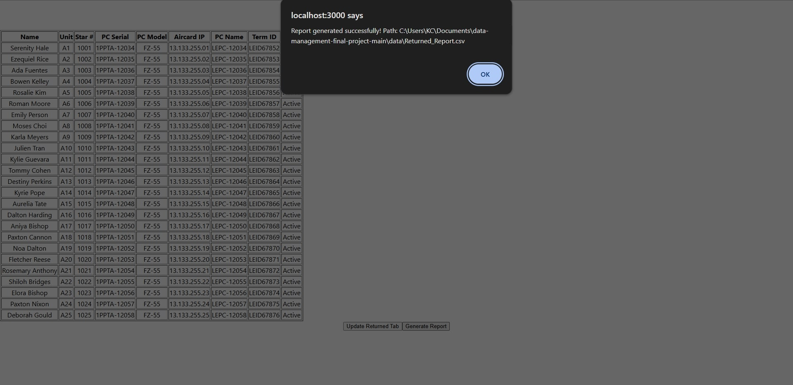

[Back to Portfolio](./)

MDT Inventory Management System
===============

-   **Class:** CSCI 419 - Data Management
-   **Grade:** A
-   **Language(s):** Python, JavaScript (React), HTML/CSS
-   **Source Code Repository:** [KTClements/data-management-final-project](https://github.com/KTClements/data-management-final-project.git)
    (Please [email me](mailto:ktclements@student.csuniv.edu?subject=GitHub%20Access) to request access.)

## Project description

This project serves as an inventory management system for Mobile Data Terminals (MDTs) assigned to law enforcement personnel. The system tracks sensitive hardware and network data, including PC Serial numbers, IP addresses, and Terminal IDs, linking them to specific officers identified by Unit and Star numbers.

The primary purpose of the application is to manage the issuance and return of these devices, ensuring accountability for equipment. The system was designed with specific constraints to handle personal information in compliance with security requirements. It relies on a local file-based database (Excel and CSV) to persist inventory data and return reports.

## How to run the program

The application requires both a Python backend and a React frontend to be running simultaneously.

### Backend Configuration & Launch
1.  Navigate to the `backend` folder.
2.  Update `app.py` to ensure `file_path` and `csv_path` match your local directory structure.
3.  Install dependencies and run the server:

```bash
cd backend
pip install -r requirements.txt
python app.py
```

### Frontend Launch

1.  Open a new terminal and navigate to the `frontend` folder.
2.  Install dependencies and start the React server:

```bash
cd frontend
npm install
npm start
```

Once both are running, the application is accessible at `http://localhost:3000`.

## UI Design

The user interface is designed for administrative staff to manage the lifecycle of MDT assignments.

The application allows users to perform the following tasks:

1.  **Enter New User:** Input Law Enforcement personnel data, including Name, Unit Number, and Star Number.
2.  **Assign Hardware:** Link specific PC Models, Serial Numbers, and Aircard IP addresses to the user.
3.  **Track Returns:** Process the return of MDTs and log the data for the chain of command.

  
Fig 1. Example of a successful report.

  
Fig 2. Local '.csv' file generated.

## 3. Additional Considerations

The application is built to operate without a traditional SQL database, instead utilizing `MDT INVENTORY.xlsx` for the primary datastore and `Returned_Report.csv` for transaction logging.

For more details see [GitHub Flavored Markdown](https://github.com/KTClements/data-management-final-project/blob/9519fc3b489b4e364a9212f33f537767d188d4c3/frontend/README.md).

[Back to Portfolio](./)
